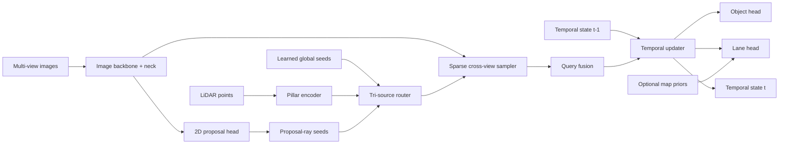

# tsqbev-poc

`tsqbev-poc` is a public proof-of-concept repository for a multimodal temporal sparse-query BEV stack built for open datasets and deployment validation.

- LiDAR grounds 3D object anchors and geometry
- cameras provide semantics, sparse refinement, and lane structure
- map priors are optional
- temporal state is sparse and streaming
- distillation is designed in from the start
- ONNX and TensorRT deployment are first-class concerns

This repo is intentionally small and evidence-driven. Every substantive module is tied back to an original paper and, where available, an official codebase. Local generated summaries are treated as internal synthesis only. The repo cites the underlying original papers, official codebases, and our own public repo/paper artifacts instead.

## What This Repo Is

- a minimal multimodal BEV research artifact
- a spec-driven and test-first implementation
- a public `nuScenes` / `OpenLane` / `MapTR`-style prototype
- a deployment-oriented codebase with measured RTX 5000 latency

## What This Repo Is Not

- a large-scale training platform
- a private or proprietary dataset integration layer
- an unbounded autonomous research loop
- a finished embedded deployment product

## Architecture At A Glance



More detail and additional diagrams are in [docs/architecture.md](docs/architecture.md) and the paper in [docs/paper/tsqbev_short_paper.pdf](docs/paper/tsqbev_short_paper.pdf).

## Current Public Scope

- Object detection: `nuScenes`, with `v1.0-mini` as the active local research contract
- Lane supervision: `OpenLane V1`
- Map priors: `MapTR`-style vectorized public priors
- Deployment validation: ONNX export and TensorRT engine build for the exportable core

## Measured Results

Measured on a local `Quadro RTX 5000`, batch size `1`, image size `256x704`:

| Path | Mean ms | p95 ms |
| --- | ---: | ---: |
| Full model, eager PyTorch | 10.872 | 10.977 |
| Exportable core, PyTorch FP32 | 7.883 | 8.057 |
| Exportable core, PyTorch FP16 | 7.492 | 7.650 |
| Exportable core, TensorRT FP16-enabled engine | 0.785 | 0.795 |

These measurements are summarized in [docs/benchmarks/rtx5000.md](docs/benchmarks/rtx5000.md). The TensorRT result applies to the current exportable core only, not the full end-to-end multimodal pipeline.

## Source Grounding

Primary references include:

- [DETR3D](https://proceedings.mlr.press/v164/wang22b.html)
- [PETR / PETRv2](https://github.com/megvii-research/PETR)
- [StreamPETR](https://github.com/exiawsh/StreamPETR)
- [Sparse4D](https://github.com/HorizonRobotics/Sparse4D)
- [SparseBEV](https://github.com/MCG-NJU/SparseBEV)
- [BEVDistill](https://arxiv.org/abs/2211.09386)
- [CMT](https://github.com/junjie18/CMT)
- [BEVFusion](https://arxiv.org/abs/2205.13542)
- [MapTR](https://github.com/hustvl/MapTR)
- [HotBEV](https://proceedings.neurips.cc/paper_files/paper/2023/file/081b08068e4733ae3e7ad019fe8d172f-Paper-Conference.pdf)

The full source map is in [docs/reference-matrix.md](docs/reference-matrix.md).

## Docs

- [Architecture](docs/architecture.md)
- [Benchmarks](docs/benchmarks/rtx5000.md)
- [Reference matrix](docs/reference-matrix.md)
- [Public baseline workflow](docs/training-baselines.md)
- [Implementation plan](docs/plan.md)
- [Short paper PDF](docs/paper/tsqbev_short_paper.pdf)
- [Short paper LaTeX](docs/paper/tsqbev_short_paper.tex)

## Repo Layout

```text
docs/           plan and evidence trail
specs/          implementation contracts
src/tsqbev/     minimal multimodal implementation
tests/          isolated and integration tests
research/       intentionally disabled research loop scaffolding
artifacts/      local run outputs and exports
```

## Quick Start

```bash
uv venv
source .venv/bin/activate
uv sync --extra dev
uv run pytest
uv run tsqbev smoke
uv run tsqbev train-step
uv run tsqbev eval
uv run tsqbev bench
```

For real public-dataset baselines:

```bash
uv sync --extra dev --extra data
uv run tsqbev check-data --dataset-root /path/to/dataset/root
```

The full workflow for `nuScenes` and `OpenLane` is documented in [docs/training-baselines.md](docs/training-baselines.md). Full accuracy results are intentionally not published until the actual datasets are present and measured.

The active bounded research loop is currently scoped to `nuScenes v1.0-mini` only:

```bash
uv run tsqbev research-loop \
  --dataset-root /path/to/nuscenes \
  --artifact-dir artifacts/baselines \
  --device cuda
```

For CUDA deployment validation on supported NVIDIA systems:

```bash
uv sync --extra dev --extra deploy
uv run tsqbev trt-bench
```

## Validation Status

- `ruff` clean
- `mypy` clean
- `pytest` passing
- ONNX export smoke passing
- TensorRT engine build validated on RTX 5000
- bounded mini-dataset research loop enabled via `program.md`
