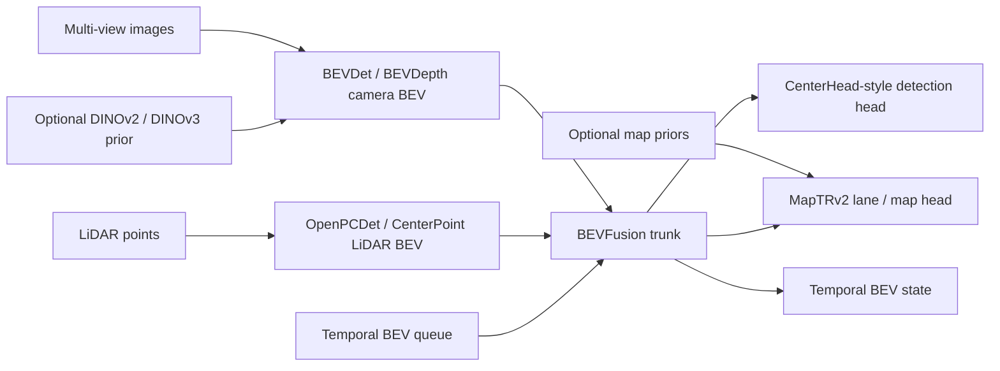

# tsqbev-poc

`tsqbev-poc` is a public migration scaffold for multimodal BEV perception. The current codebase
still carries a legacy sparse-query student for comparison, but the primary target is now a dense
BEV fusion stack built from public upstreams and tuned for deployment validation.

[](https://github.com/achbogga/tsqbev-poc/actions/workflows/ci.yml)


- the legacy sparse-query line remains comparison evidence only
- LiDAR, camera, and map/lane are equal-priority targets in the reset stack
- dense BEV fusion is the primary target architecture
- distillation is designed in from the start
- optional external LiDAR teacher bootstrap is scaffolded
- ONNX, TensorRT, and Orin deployment stay first-class concerns

This repo is intentionally small and evidence-driven. Every substantive module is tied back to an original paper and, where available, an official codebase. Local generated summaries are treated as internal synthesis only. The repo cites the underlying original papers, official codebases, and our own public repo/paper artifacts instead.
When tracking is enabled, runs are mirrored to Weights & Biases under the entity `achbogga-track`.

## Quick Status

| Track | Status | Evidence |
| --- | --- | --- |
| CI | 🟢 Passing | `ruff`, `mypy`, `pytest` currently pass locally; GitHub Actions badge is wired in |
| Legacy mini incumbent | 🟡 Real but weak | `mini_propheavy_mbv3_frozen_query_boost`, `mini_val NDS = 0.01581`, `mAP = 1.11e-04`, `17.19 ms` |
| Dense-BEV reset | 🟡 Scaffolded | target stack documented in [docs/stack-reset.md](docs/stack-reset.md); public upstream baselines still need to be reproduced in the repo |
| Teacher bootstrap | 🟢 Verified | external OpenPCDet `CenterPoint-PointPillar` reached `0.4997 NDS` on `mini_val`; cache coverage is full |
| Legacy teacher lift | 🟡 Strong on overfit, not scale-ready | corrected 32-sample balanced teacher-anchor overfit reached `NDS = 0.1001`, `mAP = 0.1391`, `car AP@4m = 0.5327`, and `7` nonzero classes; paired `mini_val` lift is still unproven |
| Scale-up readiness | 🔴 Blocked | the main remaining blocker is optimization: the repaired overfit run still missed the `train_total_ratio <= 0.40` gate at `0.4703` |
| Tracking | 🟢 Online | W&B smoke run synced under `achbogga-track` |

The current state is straightforward: the public repo is healthy, tested, deploy-checked, and tracked, but the legacy student model is not yet strong enough to justify scaling compute by 10x. The reset stack is documented, not yet reproduced.

## What This Repo Is

- a minimal multimodal BEV research artifact
- a spec-driven and test-first implementation
- a migration scaffold from the legacy sparse-query line to a public dense-BEV stack
- a deployment-oriented codebase with measured RTX 5000 latency

## Target Stack

The current reset target is a dense-BEV fusion stack built from public upstreams:

- LiDAR encoder: `OpenPCDet` / `PointPillars` / `CenterPoint`
- camera encoder: `BEVDet` / `BEVDepth`
- fusion trunk: `BEVFusion`
- lane / map head: `MapTRv2` family
- public lane reference path: `OpenLane` / `PersFormer`
- optional dense teachers or feature priors: `DINOv2` / `DINOv3`
- deployment specialization: `EfficientViT`, then `OFA` / `AMC` / `HAQ` for compression and quantization

The dense-BEV reset is still a scaffolded migration target in this repo. It is not yet the fully
integrated runtime.

## What This Repo Is Not

- a large-scale training platform
- a private or proprietary dataset integration layer
- an unbounded autonomous research loop
- a fully integrated dense-BEV runtime yet
- a finished embedded deployment product

## Architecture At A Glance



More detail, including the legacy sparse-query comparison line, is in
[docs/architecture.md](docs/architecture.md) and the paper in
[docs/paper/tsqbev_short_paper.pdf](docs/paper/tsqbev_short_paper.pdf).

## Current Public Scope

- Object detection: `nuScenes`, with `v1.0-mini` as the active local research contract
- Lane and map supervision: `OpenLane V1` plus `MapTRv2`-style vectorized public priors
- Teacher bootstrap: optional cached external LiDAR teacher path, starting with public
  `CenterPoint` / `PointPillars`-style teachers
- Deployment validation: ONNX export and TensorRT engine build for the exportable core
- Experiment tracking: optional W&B logging for baselines, gates, and research-loop recipes
- Legacy sparse-query measurements: retained only as comparison evidence while the reset stack is scaffolded

## Legacy Sparse-Query Measurements

RTX 5000 latency, batch size `1`, image size `256x704`:

| Path | Mean ms | p95 ms |
| --- | ---: | ---: |
| Full model, eager PyTorch | 10.872 | 10.977 |
| Exportable core, PyTorch FP32 | 7.883 | 8.057 |
| Exportable core, PyTorch FP16 | 7.492 | 7.650 |
| Exportable core, TensorRT FP16-enabled engine | 0.785 | 0.795 |

The latency measurements are summarized in [docs/benchmarks/rtx5000.md](docs/benchmarks/rtx5000.md).
The TensorRT result applies to the current exportable core only, not the full end-to-end multimodal
pipeline.

Latest completed teacher-backed bounded `nuScenes v1.0-mini` sweep:

| Run | Stage | Key Setting | Val Total | mAP | NDS | Mean ms | Source Mix | Decision |
| --- | --- | --- | ---: | ---: | ---: | ---: | --- | --- |
| Balanced `MobileNetV3-Large` | baseline | frozen, `q_lidar=96`, `q_2d=64` | 21.0663 | `8.7234e-05` | `4.3617e-05` | 17.2304 | `50/33/17` | discard |
| Proposal-heavy `MobileNetV3-Large` | explore | frozen, `q_lidar=64`, `q_2d=96` | 24.7025 | `2.6575e-04` | `1.3288e-04` | 17.2103 | `33/50/17` | discard |
| Proposal-heavy `EfficientNet-B0` | explore | frozen, `q_lidar=64`, `q_2d=96` | 19.4404 | `4.6209e-05` | `0.01247` | 21.9496 | `33/50/17` | promote |
| Teacher-seeded `EfficientNet-B0` | exploit | frozen, `replace_lidar` teacher seeds | 22.9615 | 0.0 | 0.0 | 21.1112 | `33/50/17` | discard |
| Query-boost `EfficientNet-B0` | exploit | frozen, `q_2d=112`, `max_q=112` | 19.6120 | `5.2059e-05` | `0.01165` | 21.7800 | `31/54/15` | discard |

The loop selects by official `mini_val` `NDS`, then `mAP`, then loss. The current incumbent is the
proposal-heavy frozen `EfficientNet-B0` recipe. It is a real, reproducible local signal, but still
well below the threshold required to justify scaling the training budget. The sweep artifacts are
summarized in [docs/benchmarks/nuscenes-mini.md](docs/benchmarks/nuscenes-mini.md) and the latest
teacher-backed bounded run in `artifacts/research_teacher_v1/research_loop/`.
The `replace_lidar` teacher row above should no longer be treated as valid evidence on the current
branch: batching used to drop `teacher_targets`, so teacher lift is being rerun with the fixed
collator, geometry-aware teacher class and box supervision, and the stronger `replace_lidar`
mode.
The same loop is also tracked in W&B when credentials are available; hyperparameter and
performance sweeps stay grouped within the same architecture-family project, while materially
different architectures are logged to separate projects.

The current scale-up answer is still "not yet": the repaired 32-sample overfit gate still failed,
with `train_ratio=0.5310`, same-subset `NDS=0.0085868`, and same-subset `mAP=0.0005329`. See
[docs/scaling-gates.md](docs/scaling-gates.md).

The strongest measured overfit rescue so far is the corrected balanced teacher-anchor variant on
the same 32-sample subset: `NDS=0.1001`, `mAP=0.1391`, `car AP @ 4.0m=0.5327`, `7` nonzero
classes, and `17.92 ms`. It still did not clear the scale gate because the subset did not overfit
enough: `train_total_ratio = 0.4703` vs the required `<= 0.40`. The current branch therefore moves
from “recover car emergence” to the narrower optimization question: how to push the same repaired
teacher-anchor recipe to actually memorize the fixed subset more completely.

The current first-principles diagnosis is narrower now: raw teacher-score truncation really was
starving the student of car anchors, and class-balanced teacher seed selection fixed that enough to
produce a real multi-class overfit result. The remaining blocker is no longer “all queries collapse
to one easy class”; it is optimization on the fixed subset.

External teacher bootstrap is now verified separately:

| Teacher | Split | External mAP | External NDS | Cache Coverage |
| --- | --- | ---: | ---: | ---: |
| OpenPCDet `CenterPoint-PointPillar` | `nuScenes v1.0-mini` `mini_val` | 0.4369 | 0.4997 | `323 / 323` train, `81 / 81` val |

That benchmark and the audited cache import are documented in
[docs/benchmarks/openpcdet-centerpoint-mini.md](docs/benchmarks/openpcdet-centerpoint-mini.md).

## Source Grounding

Primary references include:

- [BEVFusion](https://github.com/mit-han-lab/bevfusion)
- [OpenPCDet](https://github.com/open-mmlab/OpenPCDet)
- [BEVDet / BEVDepth](https://github.com/HuangJunJie2017/BEVDet)
- [MapTR / MapTRv2](https://github.com/hustvl/MapTR)
- [PersFormer](https://github.com/OpenDriveLab/PersFormer_3DLane)
- [DINOv2](https://github.com/facebookresearch/dinov2)
- [DINOv3](https://github.com/facebookresearch/dinov3)
- [EfficientViT](https://github.com/mit-han-lab/efficientvit)
- [MIT HAN Lab OFA](https://hanlab.mit.edu/projects/ofa)
- [MIT HAN Lab AMC](https://hanlab.mit.edu/projects/amc)
- [MIT HAN Lab HAQ](https://hanlab.mit.edu/projects/haq)
- [DETR3D](https://proceedings.mlr.press/v164/wang22b.html)
- [PETR / PETRv2](https://github.com/megvii-research/PETR)
- [StreamPETR](https://github.com/exiawsh/StreamPETR)
- [Sparse4D](https://github.com/HorizonRobotics/Sparse4D)
- [SparseBEV](https://github.com/MCG-NJU/SparseBEV)
- [CenterPoint](https://github.com/tianweiy/CenterPoint)
- [OpenPCDet](https://github.com/open-mmlab/OpenPCDet)
- [BEVDistill](https://arxiv.org/abs/2211.09386)
- [PillarNet](https://github.com/VISION-SJTU/PillarNet)
- [CMT](https://github.com/junjie18/CMT)
- [HotBEV](https://proceedings.neurips.cc/paper_files/paper/2023/file/081b08068e4733ae3e7ad019fe8d172f-Paper-Conference.pdf)
- [NVIDIA DeepStream DS3D BEVFusion docs](https://docs.nvidia.com/metropolis/deepstream/7.1/text/DS_3D_MultiModal_Lidar_Camera_BEVFusion.html)

The full source map is in [docs/reference-matrix.md](docs/reference-matrix.md).

## Docs

- [Architecture](docs/architecture.md)
- [RTX 5000 latency benchmark](docs/benchmarks/rtx5000.md)
- [nuScenes mini baseline](docs/benchmarks/nuscenes-mini.md)
- [OpenPCDet teacher bootstrap benchmark](docs/benchmarks/openpcdet-centerpoint-mini.md)
- [nuScenes overfit gate](docs/benchmarks/nuscenes-overfit-gate.md)
- [Scaling gates](docs/scaling-gates.md)
- [Teacher bootstrap](docs/teacher-bootstrap.md)
- [OpenPCDet CenterPoint teacher runbook](docs/openpcdet-centerpoint-teacher.md)
- [Dense-BEV reset stack](docs/stack-reset.md)
- [Reference matrix](docs/reference-matrix.md)
- [Public baseline workflow](docs/training-baselines.md)
- [Implementation plan](docs/plan.md)
- [Short paper PDF](docs/paper/tsqbev_short_paper.pdf)
- [Short paper LaTeX](docs/paper/tsqbev_short_paper.tex)

## Repo Layout

```text
docs/           plan and evidence trail
specs/          implementation contracts
src/tsqbev/     minimal multimodal implementation
tests/          isolated and integration tests
research/       bounded research-loop recipes and evidence
artifacts/      local run outputs, exports, and mini-baseline results
```

## Quick Start

```bash
uv venv
source .venv/bin/activate
uv sync --extra dev
uv run pytest
uv run tsqbev smoke
uv run tsqbev train-step
uv run tsqbev eval
uv run tsqbev bench
```

For real public-dataset baselines:

```bash
uv sync --extra dev --extra data
uv run tsqbev check-data --dataset-root /path/to/dataset/root
```

The full workflow for `nuScenes` and `OpenLane` is documented in [docs/training-baselines.md](docs/training-baselines.md). Full `v1.0-trainval` accuracy is not published yet; the repo currently reports measured `v1.0-mini` results only.

Inspect the dense-BEV reset recommendation and the local migration gap directly from the CLI:

```bash
uv run tsqbev reset-stack --report-format markdown
uv run tsqbev reset-gap-report
uv run tsqbev upstream-registry
uv run tsqbev check-upstream-stack --projects-root /home/achbogga/projects
```

The repo now also has a dedicated tiny-subset overfit gate for `nuScenes`, which evaluates the
exact same fixed token subset used for training:

```bash
uv run tsqbev overfit-nuscenes \
  --dataset-root /path/to/nuscenes \
  --artifact-dir artifacts/gates \
  --preset rtx5000-nuscenes-query-boost \
  --version v1.0-mini \
  --train-split mini_train \
  --subset-size 32 \
  --epochs 128 \
  --max-train-steps 1024 \
  --batch-size 4 \
  --grad-accum-steps 1 \
  --optimizer-schedule constant \
  --grad-clip-norm 5.0 \
  --loss-mode focal_hardneg \
  --score-threshold-candidates 0.05 0.15 0.25 \
  --top-k-candidates 32 64 112 \
  --device cuda
```

The active bounded research loop is currently scoped to `nuScenes v1.0-mini` only and now follows
the strongest transferable ideas from Karpathy's `autoresearch`: one incumbent, a fixed comparable
train-step budget, bounded exploration, bounded exploitation, append-only ledgers, and explicit
promote/discard semantics.

```bash
uv run tsqbev research-loop \
  --dataset-root /path/to/nuscenes \
  --artifact-dir artifacts/baselines \
  --max-experiments 5 \
  --device cuda
```

Teacher-assisted training is now scaffolded through cached teacher targets:

```bash
uv run tsqbev cache-teacher-nuscenes \
  --dataset-root /path/to/nuscenes \
  --version v1.0-mini \
  --result-json /path/to/external_teacher_results.json \
  --teacher-cache-dir /path/to/teacher-cache
```

Then train from the cache:

```bash
uv run tsqbev train-nuscenes \
  --dataset-root /path/to/nuscenes \
  --preset rtx5000-nuscenes-teacher \
  --version v1.0-mini \
  --train-split mini_train \
  --split mini_val \
  --teacher-kind cache \
  --teacher-cache-dir /path/to/teacher-cache
```

Use `--preset rtx5000-nuscenes-teacher` or `--teacher-seed-mode replace_lidar` when the
cached teacher outputs include `object_boxes`, `object_labels`, and `object_scores`. On the
current branch, `replace_lidar` is the default full LiDAR-seed replacement mode and
`replace_lidar_refs` is the legacy ref-only ablation.

Audit cache coverage before claiming any teacher lift:

```bash
uv run tsqbev audit-teacher-cache-nuscenes \
  --dataset-root /path/to/nuscenes \
  --version v1.0-mini \
  --split mini_val \
  --teacher-cache-dir /path/to/teacher-cache \
  --output-dir artifacts/teacher_cache_audit
```

The exact external OpenPCDet `CenterPoint-PointPillar` runbook is documented in
[docs/openpcdet-centerpoint-teacher.md](docs/openpcdet-centerpoint-teacher.md).

Check whether a machine is actually ready for that external teacher path:

```bash
uv run tsqbev check-openpcdet-env \
  --openpcdet-repo-root /path/to/OpenPCDet
```

For CUDA deployment validation on supported NVIDIA systems:

```bash
uv sync --extra dev --extra deploy
uv run tsqbev trt-bench
```

## Validation Status

- `ruff` clean
- `mypy` clean
- `pytest` passing
- ONNX export smoke passing
- TensorRT engine build validated on RTX 5000
- optional W&B tracking integrated for all substantive experiment entrypoints
- latest bounded `nuScenes v1.0-mini` teacher-backed sweep recorded with official per-recipe `mini_val` evaluation
- current best completed `mini_val` result: `NDS = 0.01247`, `mAP = 4.6209e-05`, `mean latency = 21.95 ms`
- explicit scale gates added; current answer remains "do not scale by 10x compute yet"
- exact-token overfit gate recorded; current verdict is fail
- optional external LiDAR teacher cache/provider scaffolding added and tested
- external OpenPCDet `CenterPoint-PointPillar` teacher verified at `0.4997 NDS` on `mini_val`
- teacher-seed replacement ablation recorded; current verdict is regression and needs redesign
- dense-BEV reset contracts, upstream registry, and local readiness/gap reports are now implemented
- bounded mini-dataset research loop enabled via `program.md`
- research loop upgraded to staged baseline/explore/exploit with `results.tsv`, per-run `manifest.json`, and machine-readable `scale_gate_verdict`
