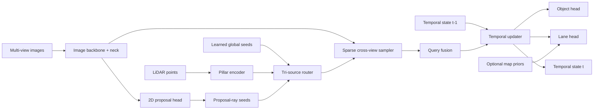

# tsqbev-poc

`tsqbev-poc` is a public proof-of-concept repository for a multimodal temporal sparse-query BEV stack built for open datasets and deployment validation.

- LiDAR grounds 3D object anchors and geometry
- cameras provide semantics, sparse refinement, and lane structure
- map priors are optional
- temporal state is sparse and streaming
- distillation is designed in from the start
- optional external LiDAR teacher bootstrap is now scaffolded
- ONNX and TensorRT deployment are first-class concerns

This repo is intentionally small and evidence-driven. Every substantive module is tied back to an original paper and, where available, an official codebase. Local generated summaries are treated as internal synthesis only. The repo cites the underlying original papers, official codebases, and our own public repo/paper artifacts instead.

## What This Repo Is

- a minimal multimodal BEV research artifact
- a spec-driven and test-first implementation
- a public `nuScenes` / `OpenLane` / `MapTR`-style prototype
- a deployment-oriented codebase with measured RTX 5000 latency

## What This Repo Is Not

- a large-scale training platform
- a private or proprietary dataset integration layer
- an unbounded autonomous research loop
- a finished embedded deployment product

## Architecture At A Glance



More detail and additional diagrams are in [docs/architecture.md](docs/architecture.md) and the paper in [docs/paper/tsqbev_short_paper.pdf](docs/paper/tsqbev_short_paper.pdf).

## Current Public Scope

- Object detection: `nuScenes`, with `v1.0-mini` as the active local research contract
- Lane supervision: `OpenLane V1`
- Map priors: `MapTR`-style vectorized public priors
- Teacher bootstrap: optional cached external LiDAR teacher path, starting with public `CenterPoint-PointPillar` style teachers
- Deployment validation: ONNX export and TensorRT engine build for the exportable core

## Measured Results

RTX 5000 latency, batch size `1`, image size `256x704`:

| Path | Mean ms | p95 ms |
| --- | ---: | ---: |
| Full model, eager PyTorch | 10.872 | 10.977 |
| Exportable core, PyTorch FP32 | 7.883 | 8.057 |
| Exportable core, PyTorch FP16 | 7.492 | 7.650 |
| Exportable core, TensorRT FP16-enabled engine | 0.785 | 0.795 |

The latency measurements are summarized in [docs/benchmarks/rtx5000.md](docs/benchmarks/rtx5000.md). The TensorRT result applies to the current exportable core only, not the full end-to-end multimodal pipeline.

Latest completed bounded `nuScenes v1.0-mini` sweep:

| Run | Stage | Key Setting | Val Total | mAP | NDS | Mean ms | Source Mix | Decision |
| --- | --- | --- | ---: | ---: | ---: | ---: | --- | --- |
| Balanced `MobileNetV3-Large` | baseline | frozen, `q_lidar=96`, `q_2d=64` | 22.0419 | 0.0 | 0.0 | 17.4492 | `50/33/17` | discard |
| Proposal-heavy `MobileNetV3-Large` | explore | frozen, `q_lidar=64`, `q_2d=96` | 23.0423 | `3.1083e-04` | `1.5541e-04` | 17.1797 | `33/50/17` | discard |
| Proposal-heavy `EfficientNet-B0` | explore | frozen, `q_lidar=64`, `q_2d=96` | 24.1645 | 0.0 | 0.0 | 21.6682 | `33/50/17` | discard |
| Query-boost `MobileNetV3-Large` | exploit | frozen, `q_lidar=64`, `q_2d=112`, `max_q=112` | 20.1352 | `1.1140e-04` | `0.0158` | 17.1938 | `31/54/15` | promote |
| Lower-LR `MobileNetV3-Large` | exploit | frozen, lower LR | 24.7614 | 0.0 | 0.0 | 17.1298 | `33/50/17` | discard |

The loop now selects by official `mini_val` `NDS`, then `mAP`, then loss, and the current best
recipe came from the exploit stage rather than the initial flat sweep. The promoted mini result is
the query-boost MobileNetV3 recipe with nonzero official `mAP` and `NDS`. The sweep artifacts are
summarized in [docs/benchmarks/nuscenes-mini.md](docs/benchmarks/nuscenes-mini.md).

The current scale-up answer is still "not yet": the first measured 32-sample overfit gate failed
with `train_ratio=0.5079`, same-subset `NDS=0.0003752`, and same-subset `mAP=0.0007504`. See
[docs/scaling-gates.md](docs/scaling-gates.md).

External teacher bootstrap is now verified separately:

| Teacher | Split | External mAP | External NDS | Cache Coverage |
| --- | --- | ---: | ---: | ---: |
| OpenPCDet `CenterPoint-PointPillar` | `nuScenes v1.0-mini` `mini_val` | 0.4369 | 0.4997 | `81 / 81` |

That benchmark is documented in
[docs/benchmarks/openpcdet-centerpoint-mini.md](docs/benchmarks/openpcdet-centerpoint-mini.md).

## Source Grounding

Primary references include:

- [DETR3D](https://proceedings.mlr.press/v164/wang22b.html)
- [PETR / PETRv2](https://github.com/megvii-research/PETR)
- [StreamPETR](https://github.com/exiawsh/StreamPETR)
- [Sparse4D](https://github.com/HorizonRobotics/Sparse4D)
- [SparseBEV](https://github.com/MCG-NJU/SparseBEV)
- [CenterPoint](https://github.com/tianweiy/CenterPoint)
- [OpenPCDet](https://github.com/open-mmlab/OpenPCDet)
- [BEVDistill](https://arxiv.org/abs/2211.09386)
- [PillarNet](https://github.com/VISION-SJTU/PillarNet)
- [CMT](https://github.com/junjie18/CMT)
- [BEVFusion](https://arxiv.org/abs/2205.13542)
- [MapTR](https://github.com/hustvl/MapTR)
- [HotBEV](https://proceedings.neurips.cc/paper_files/paper/2023/file/081b08068e4733ae3e7ad019fe8d172f-Paper-Conference.pdf)

The full source map is in [docs/reference-matrix.md](docs/reference-matrix.md).

## Docs

- [Architecture](docs/architecture.md)
- [RTX 5000 latency benchmark](docs/benchmarks/rtx5000.md)
- [nuScenes mini baseline](docs/benchmarks/nuscenes-mini.md)
- [OpenPCDet teacher bootstrap benchmark](docs/benchmarks/openpcdet-centerpoint-mini.md)
- [nuScenes overfit gate](docs/benchmarks/nuscenes-overfit-gate.md)
- [Scaling gates](docs/scaling-gates.md)
- [Teacher bootstrap](docs/teacher-bootstrap.md)
- [OpenPCDet CenterPoint teacher runbook](docs/openpcdet-centerpoint-teacher.md)
- [Reference matrix](docs/reference-matrix.md)
- [Public baseline workflow](docs/training-baselines.md)
- [Implementation plan](docs/plan.md)
- [Short paper PDF](docs/paper/tsqbev_short_paper.pdf)
- [Short paper LaTeX](docs/paper/tsqbev_short_paper.tex)

## Repo Layout

```text
docs/           plan and evidence trail
specs/          implementation contracts
src/tsqbev/     minimal multimodal implementation
tests/          isolated and integration tests
research/       bounded research-loop recipes and evidence
artifacts/      local run outputs, exports, and mini-baseline results
```

## Quick Start

```bash
uv venv
source .venv/bin/activate
uv sync --extra dev
uv run pytest
uv run tsqbev smoke
uv run tsqbev train-step
uv run tsqbev eval
uv run tsqbev bench
```

For real public-dataset baselines:

```bash
uv sync --extra dev --extra data
uv run tsqbev check-data --dataset-root /path/to/dataset/root
```

The full workflow for `nuScenes` and `OpenLane` is documented in [docs/training-baselines.md](docs/training-baselines.md). Full `v1.0-trainval` accuracy is not published yet; the repo currently reports measured `v1.0-mini` results only.

The repo now also has a dedicated tiny-subset overfit gate for `nuScenes`, which evaluates the
exact same fixed token subset used for training:

```bash
uv run tsqbev overfit-nuscenes \
  --dataset-root /path/to/nuscenes \
  --artifact-dir artifacts/gates \
  --preset rtx5000-nuscenes-query-boost \
  --version v1.0-mini \
  --train-split mini_train \
  --subset-size 32 \
  --epochs 128 \
  --max-train-steps 1024 \
  --batch-size 4 \
  --grad-accum-steps 1 \
  --device cuda
```

The active bounded research loop is currently scoped to `nuScenes v1.0-mini` only and now follows
the strongest transferable ideas from Karpathy's `autoresearch`: one incumbent, a fixed comparable
train-step budget, bounded exploration, bounded exploitation, append-only ledgers, and explicit
promote/discard semantics.

```bash
uv run tsqbev research-loop \
  --dataset-root /path/to/nuscenes \
  --artifact-dir artifacts/baselines \
  --max-experiments 5 \
  --device cuda
```

Teacher-assisted training is now scaffolded through cached teacher targets:

```bash
uv run tsqbev cache-teacher-nuscenes \
  --dataset-root /path/to/nuscenes \
  --version v1.0-mini \
  --result-json /path/to/external_teacher_results.json \
  --teacher-cache-dir /path/to/teacher-cache
```

Then train from the cache:

```bash
uv run tsqbev train-nuscenes \
  --dataset-root /path/to/nuscenes \
  --preset rtx5000-nuscenes-teacher \
  --version v1.0-mini \
  --train-split mini_train \
  --split mini_val \
  --teacher-kind cache \
  --teacher-cache-dir /path/to/teacher-cache
```

Use `--preset rtx5000-nuscenes-teacher` or `--teacher-seed-mode replace_lidar` when the cached
teacher outputs include `object_boxes`, `object_labels`, and `object_scores` for seed replacement.

Audit cache coverage before claiming any teacher lift:

```bash
uv run tsqbev audit-teacher-cache-nuscenes \
  --dataset-root /path/to/nuscenes \
  --version v1.0-mini \
  --split mini_val \
  --teacher-cache-dir /path/to/teacher-cache \
  --output-dir artifacts/teacher_cache_audit
```

The exact external OpenPCDet `CenterPoint-PointPillar` runbook is documented in
[docs/openpcdet-centerpoint-teacher.md](docs/openpcdet-centerpoint-teacher.md).

Check whether a machine is actually ready for that external teacher path:

```bash
uv run tsqbev check-openpcdet-env \
  --openpcdet-repo-root /path/to/OpenPCDet
```

For CUDA deployment validation on supported NVIDIA systems:

```bash
uv sync --extra dev --extra deploy
uv run tsqbev trt-bench
```

## Validation Status

- `ruff` clean
- `mypy` clean
- `pytest` passing
- ONNX export smoke passing
- TensorRT engine build validated on RTX 5000
- strengthened bounded `nuScenes v1.0-mini` sweep recorded with official per-recipe `mini_val` evaluation
- current best completed `mini_val` result: `NDS = 0.0158`, `mAP = 1.1140e-04`
- explicit scale gates added; current answer is still "do not scale by 10x compute yet"
- exact-token overfit gate recorded; current verdict is fail
- optional external LiDAR teacher cache/provider scaffolding added and tested
- bounded mini-dataset research loop enabled via `program.md`
- research loop upgraded to staged baseline/explore/exploit with `results.tsv`, per-run `manifest.json`, and machine-readable `scale_gate_verdict`
