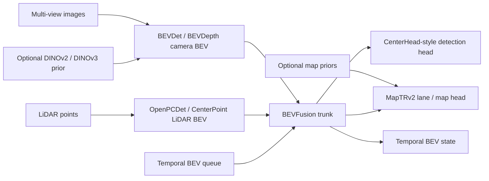
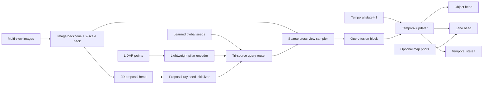
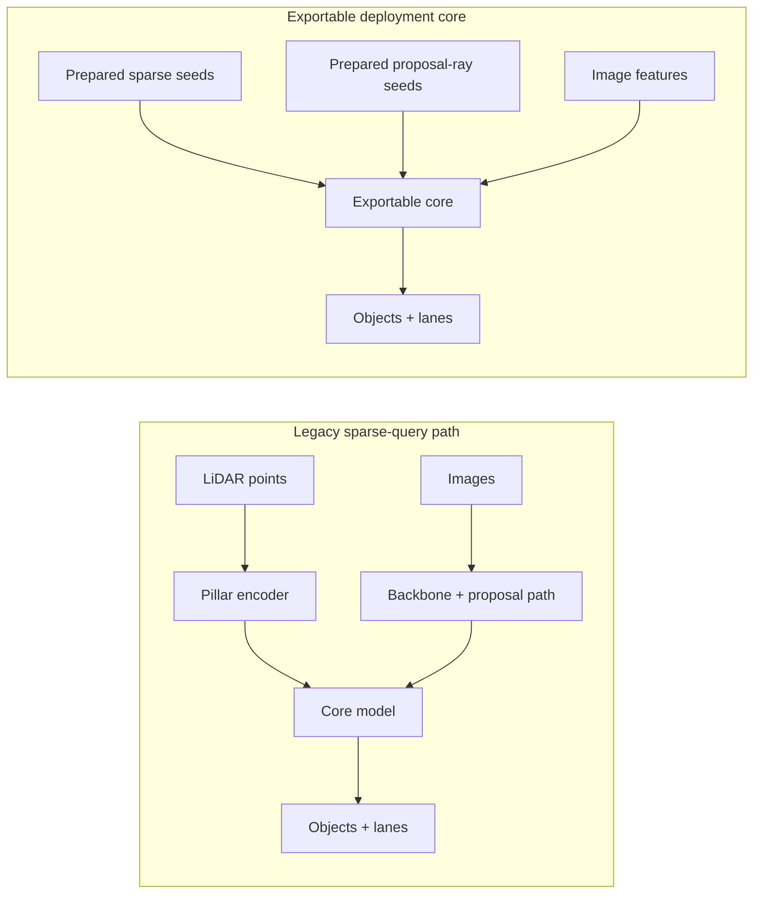

# Architecture

`tsqbev-poc` is currently a migration scaffold. The legacy implementation is a sparse-query
multimodal BEV prototype, but the target architecture is now a dense BEV fusion stack assembled
from public upstreams and optimized for AGX Orin deployability.

The underlying public references are indexed in [reference-matrix.md](./reference-matrix.md).

## Target Reset Stack

The reset stack keeps detection and lane/map as equal-priority heads on the same shared BEV
representation. The camera path is the semantic and temporal lifting path. The LiDAR path is the
geometry anchor path.

## Legacy Sparse-Query Line

The current implementation still exists as a comparison control:

- LiDAR-grounded object initialization
- camera-driven sparse refinement
- persistent sparse temporal state
- camera-dominant lane reasoning
- optional map priors

## Deployment Split

The current public repo measures two paths:

- the legacy sparse-query PyTorch model, including LiDAR seed extraction
- the exportable deployment core, which accepts prepared sparse seeds

This separation is intentional. It keeps the deployable graph compact and TensorRT-friendly while
the reset stack is still being reproduced from public upstreams.

## Public Dataset Scope

The public repo currently targets:

- `nuScenes` for 3D object detection
- `OpenLane V1` and `MapTRv2`-style vector priors for lane / map supervision
- `MapTR`-style vectorized priors for public map tokens

Private or proprietary dataset compatibility is intentionally out of scope in this public repository.

## Measured Deployment Notes

Measured RTX 5000 results are summarized in [benchmarks/rtx5000.md](./benchmarks/rtx5000.md).

- Legacy sparse-query full model, eager PyTorch, `256x704`, batch 1: mean `10.872 ms`, p95 `10.977 ms`
- Legacy exportable core, TensorRT FP16-enabled engine, `256x704`, batch 1: mean `0.785 ms`, p95 `0.795 ms`

Those TensorRT numbers apply to the current exportable core only, not the dense-BEV reset stack.
