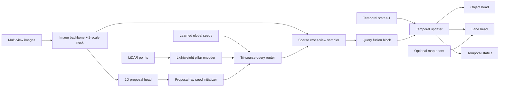
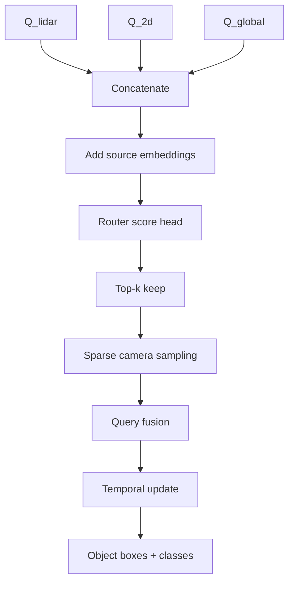
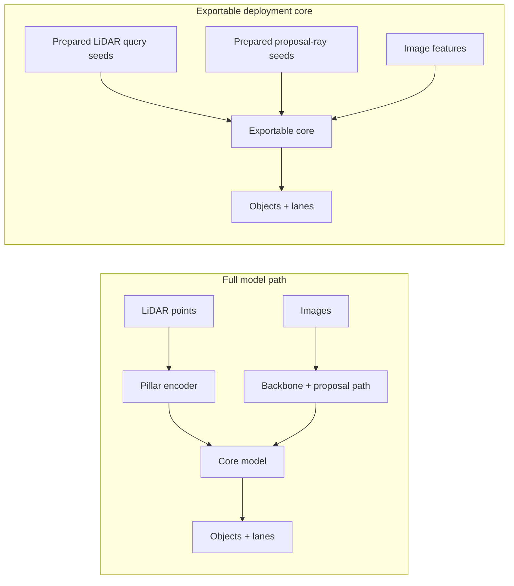

# Architecture

`tsqbev-poc` is a minimal multimodal BEV stack built around sparse object queries instead of a dense recurrent BEV tensor. The current implementation focuses on:

- LiDAR-grounded object initialization
- camera-driven sparse refinement
- persistent temporal state
- camera-dominant lane reasoning
- optional map priors
- exportability and deployment measurement

The underlying public references are indexed in [reference-matrix.md](./reference-matrix.md).

## System Overview

## Query Lifecycle

The object pathway uses three seed sources:

- `Q_lidar`: geometric anchors from the LiDAR pillar encoder
- `Q_2d`: camera proposal seeds backprojected along calibrated rays
- `Q_global`: learned recovery anchors for recall

The router scores and filters the concatenated seed bank before sparse image sampling. This keeps the runtime bounded and follows the sparse-query design direction of DETR3D, PETR/PETRv2, and Sparse4D.

## Deployment Split

The current public repo measures two paths:

- the full PyTorch model, including LiDAR seed extraction
- the exportable deployment core, which accepts prepared sparse seeds

This separation is intentional. It keeps the deployable graph compact and TensorRT-friendly while the public POC is still stabilizing.

## Public Dataset Scope

The public repo currently targets:

- `nuScenes` for 3D object detection
- `OpenLane V1` for lane supervision
- `MapTR`-style vectorized priors for public map tokens

Private or proprietary dataset compatibility is intentionally out of scope in this public repository.

## Measured Deployment Notes

Measured RTX 5000 results are summarized in [benchmarks/rtx5000.md](./benchmarks/rtx5000.md).

- Full model, eager PyTorch, `256x704`, batch 1: mean `10.872 ms`, p95 `10.977 ms`
- Exportable core, TensorRT FP16-enabled engine, `256x704`, batch 1: mean `0.785 ms`, p95 `0.795 ms`

Those TensorRT numbers apply to the current exportable core only, not the full end-to-end multimodal pipeline.
